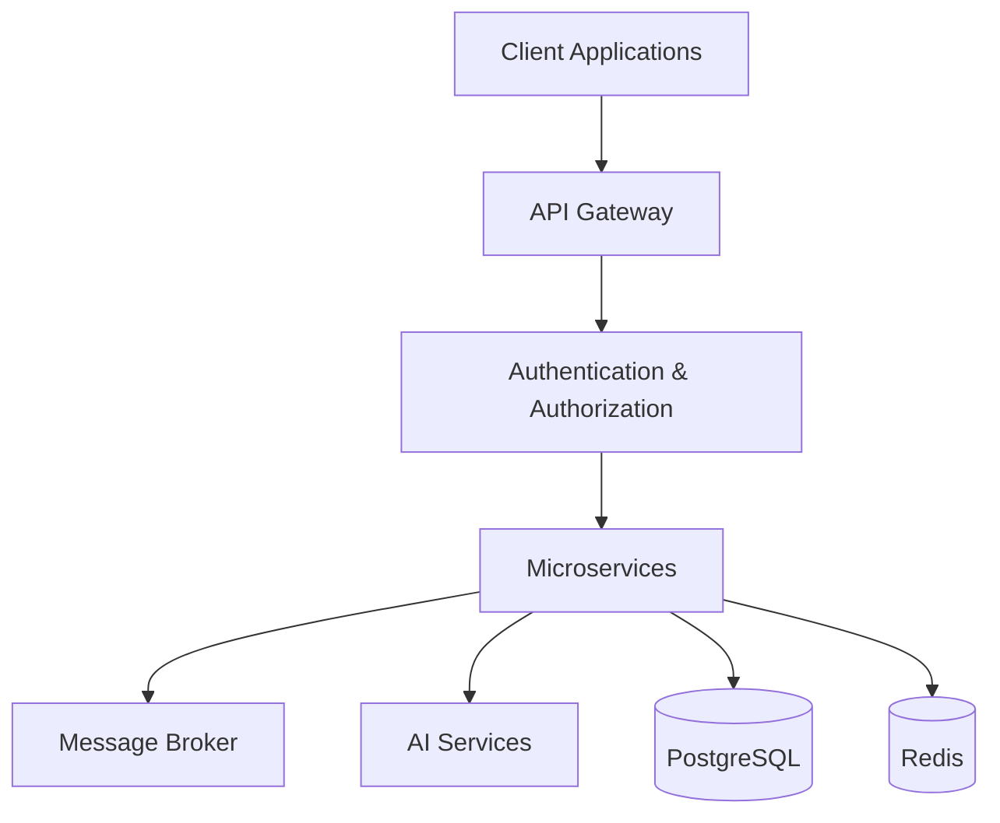

<div align="center">

# Hi 👋 I'm Kenneth Otoro

### AI Systems Engineer • Senior Backend Engineer • Enterprise AI • Cloud • DevSecOps


<p>

<a href="https://linkedin.com/in/kennethotoro">

</a>

<a href="https://kennethotoro-kodex.com.ng">

</a>

<a href="mailto:kennethotoro@gmail.com">

</a>

</p>


</div>

---

# 🚀 About Me

I'm an **AI Systems Engineer** and **Senior Backend Engineer** with **9+ years** of experience designing secure, scalable enterprise software across **FinTech, Banking, Logistics, SaaS, and Artificial Intelligence**.

My passion is building intelligent systems that solve real business problems through scalable architecture, cloud-native engineering, AI automation, and secure backend platforms.

---

# 💡 What I Build

- 🤖 Enterprise AI Platforms
- 🧠 AI Agents & LLM Integrations
- ⚙️ ASP.NET Core Backend Systems
- ☁️ Azure & AWS Cloud Solutions
- 🏦 FinTech & Payment Infrastructure
- 📦 Distributed Microservices
- 🔒 Secure APIs & DevSecOps
- 📊 Intelligent Business Automation

---

# 🛠 Tech Stack

<p align="center">


</p>

---

# 📊 Public Development Activity

> **Note:** The statistics below reflect my **public GitHub activity**. Much of my day-to-day engineering work is delivered through private enterprise repositories hosted on **Azure DevOps** and internal source control platforms.

<p align="center">


</p>

<p align="center">


</p>

<p align="center">


</p>

---

# 🏆 GitHub Achievements

<p align="center">


</p>

---

# ⭐ Featured Projects

| Project | Description |
|---------|-------------|
| 🤖 Enterprise AI Platform | AI Agents, Workflow Automation & LLM Integration |
| 💳 Merchant Platform | Enterprise FinTech & Payment Infrastructure |
| 🧠 AI Financial Reconciliation Engine | Intelligent Transaction Matching & Reporting |
| 🛡 Identity Verification Platform | BVN, NIN & Consent Management |
| 🎓 School ERP | Cloud-Native Education Platform |
| ☁️ AI Infrastructure | Enterprise AI Runtime & Automation |

---

# 🌱 Currently Building

- 🚀 Enterprise AI Platform
- 🤖 AI Agent Framework for .NET
- 🧠 AI Business Automation Engine
- 🛡 Identity Verification Platform
- ☁️ Cloud-Native Enterprise Services
- 📚 Open Source Enterprise Frameworks

---

# 💼 Core Expertise

```text
Enterprise AI             ████████████████████

Backend Engineering       ████████████████████

Cloud Architecture        ██████████████████░

Microservices             ███████████████████

DevSecOps                 █████████████████░░

System Design             ███████████████████

FinTech                   ███████████████████

Distributed Systems       ██████████████████░
```

---

# 🏢 Enterprise Engineering Experience

Over the past **9+ years**, I have contributed to the design, development, and delivery of enterprise software across fintech, banking, logistics, and SaaS environments.

A significant portion of this work is maintained within **private Azure DevOps repositories** and internal enterprise source control systems. These repositories contain proprietary business logic, financial systems, customer data, and production infrastructure that cannot be made public.

The projects shared on this GitHub profile represent my **personal work, open-source contributions, architectural approaches, and engineering practices**, while my professional experience reflects the delivery of secure, scalable, production-grade enterprise solutions.

### Enterprise Platforms Delivered

- 💳 FinTech Payment Infrastructure
- 🏦 Banking & Financial Systems
- 🤖 Enterprise AI & Intelligent Automation
- 🛡 Identity Verification Platforms
- ☁️ Cloud-Native Applications
- ⚡ High-Availability Backend Services
- 📦 Distributed Microservices
- 🔒 Secure Enterprise APIs

---

# ⚙️ Engineering Toolchain

| Category | Technologies |
|-----------|--------------|
| **Source Control** | Git • GitHub • Azure DevOps |
| **CI/CD** | Azure Pipelines • GitHub Actions |
| **Cloud** | Microsoft Azure • AWS |
| **Containers** | Docker • Kubernetes |
| **Architecture** | Clean Architecture • DDD • CQRS • Microservices |
| **AI** | OpenAI • Gemini • AI Agents • Prompt Engineering |

---

# 🏗 Typical Enterprise Architecture



---

# 🤝 Open To Collaborate On

- Enterprise AI Platforms
- AI Agents
- Backend Engineering
- Cloud Architecture
- FinTech Solutions
- Technical Leadership
- Open Source Projects
- Remote Engineering Opportunities
- Consulting Engagements

---

# 📫 Connect With Me

🌐 **Portfolio**  
https://kennethotoro-kodex.com.ng

💼 **LinkedIn**  
https://linkedin.com/in/kennethotoro

📧 **Email**  
kodexkenth@gmail.com

---

<div align="center">

## 💡 Engineering Philosophy

*"Great software isn't measured by the amount of code written—it's measured by the business value it delivers, the reliability it provides, and the people it empowers."*

⭐ Thanks for visiting my profile! Feel free to explore my repositories, connect with me, or collaborate on innovative enterprise software and AI solutions.

</div>
